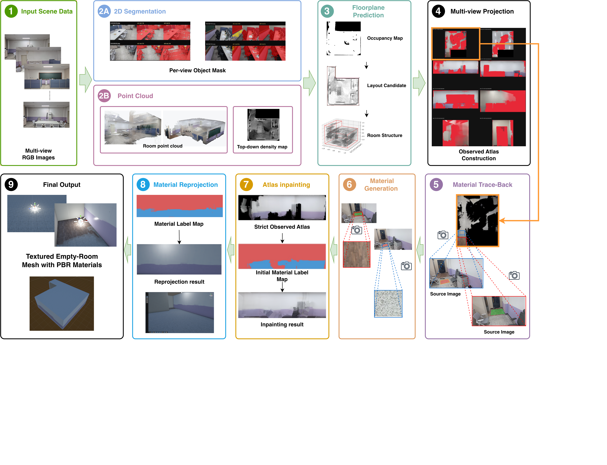

<h1 align="center">V3B: Qualified Evidence Provenance for Empty-Room Reconstruction with Multi-Material PBR Atlases</h1>

<p align="center">
  Research code for the IEEE VR submission<br>
  <strong>Furnished RGB photographs → editable empty-room mesh + multi-material PBR atlases</strong>
</p>

<p align="center">
  <a href="https://github.com/MisaKID1412/v3b_v3/actions/workflows/source-integrity.yml"></a>
</p>

<p align="center">
  <a href="#overview">Overview</a> ·
  <a href="#method">Method</a> ·
  <a href="#quick-start">Quick start</a> ·
  <a href="docs/GETTING_STARTED.md">Run &amp; Unity import</a> ·
  <a href="#citation">Citation</a>
</p>

## Overview

**V3B reconstructs an editable empty room from overlapping photographs of a furnished room.**
Its output is an explicit floor, ceiling, and wall mesh with per-surface
BaseColor, normal, roughness, and metallic atlases, ready for Unity import,
relighting, and material editing.

The central idea is **Qualified Evidence Provenance (QEP)**: qualify the
observations used for reconstruction, retain their source-image provenance,
and keep generated completion subordinate to visible evidence. A plausible
inpainted region must not become evidence for a new material.

<p align="center">
  <a href="docs/assets/pipeline.png"></a>
</p>

*Pipeline overview. Admitted observations retain their source views. Material
regions trace back to rectified source patches for PBR estimation; visible
evidence determines material identity, while completion supports its extension
into unseen regions. Click the figure for the full-resolution image.*

## Method

QEP separates three questions:

1. **Which observations are trustworthy?** Semantic rejection masks and
   geometric/projection checks qualify permanent-surface observations before
   they contribute to the atlas.
2. **Where did a material estimate come from?** Contribution records connect
   atlas support to the original photographs. Material estimation uses a
   geometrically rectified source patch, not an untraceable fused atlas crop.
3. **What is generated content allowed to decide?** Visible evidence determines
   material identities and exemplars. Inpainting supplies lower-authority
   context for extending material territories, not new identities or final
   baked RGB textures.

### Implementation in this release

The public `v3b_v3` runner uses one image-to-Unity path across rooms:

- **Geometry and admitted observations:** DA3, RoomFormer, and SAM 3 supply
  depth/camera evidence, layout proposals, and reject masks.
- **Material identity:** fine appearance proposals are resolved with MatSeg
  same/different-material evidence from reverse-projected original views.
  Lab proposals alone do not decide material identity.
- **Trace-back and PBR:** each surviving material is selected by maximum atlas
  projection mass, traced to an original image, rectified, and inferred by
  unchanged CHORD with one configuration.
- **Territories and texture scale:** the layout backend infers material
  territories, and footprint-aware whole-territory synthesis expands the
  exemplars without a fixed tile grid or rectangular patch cut-and-paste.
  Network input resolution is not treated as physical texture coverage.
- **Aligned export:** all four PBR channels share material boundaries and
  spatial mapping; the exporter also packs metallic/smoothness for Unity.

Selection rules do not branch on room names, surface names, an L-shaped
layout, or a fixed material count. This is a generalization design, not a
guarantee that every unseen room or material will reconstruct correctly.

The figure shows conceptual processing stages; the runner groups the work
into eight execution stages. See the [pipeline contract](docs/PIPELINE.md)
for the exact current implementation and its safeguards.

## Quick start

### 1. Get the code

```bash
git clone https://github.com/MisaKID1412/v3b_v3.git
cd v3b_v3
```

### 2. Prepare the environment and input

The tested runtime is **Linux + an NVIDIA CUDA GPU**. The low-memory DA3 path
supports an 11 GiB RTX 2080 Ti; runtime and memory needs depend on the input.

Install the external repositories and checkpoints listed in
[THIRD_PARTY.md](THIRD_PARTY.md), then configure their local paths:

```bash
python -m pip install -r requirements-runtime.txt
cp config/v3b.env.example config/v3b.env
```

Edit `config/v3b.env` to set the dataset, Python environments, model repositories,
and checkpoints. Separate environments are recommended for the external models;
the requirements file alone does not install them.

```text
my_room/
  input_images/
    0000.jpg
    0001.jpg
    ...
```

A COLMAP model is not required by the default DA3-aligned path. Known-camera
metadata and compatible cached DA3 outputs are optional; see
[the input contract](docs/GETTING_STARTED.md#input-contract).

### 3. Reconstruct and export

```bash
bash run_from_images.sh
```

Resume an interrupted run with:

```bash
RESUME=1 bash run_from_images.sh
```

Outputs are written under `outputs/<RUN_NAME>/`:

| Output | Contents |
|---|---|
| `pbr_full_normalized/` | Per-face PBR maps, previews, and scale/lattice audits |
| `unity_project/` | OBJ/MTL, textures, packed metallic/smoothness, and Editor importer |
| `v3b_v3.unitypackage` | Importable Unity asset package |
| `v3b_v3_end_to_end_manifest.json` | Hash-linked provenance from inputs to export |

In Unity, use **Assets → Import Package → Custom Package** and select the
generated `.unitypackage`. The included importer creates per-face materials
and `room_pbr.prefab`; setup can be rerun via **Tools → v3b_v3 → Apply PBR**.
See [the full run and import guide](docs/GETTING_STARTED.md) for shader support,
custom configurations, stage controls, and intermediate audit files.

## Release scope and reproducibility

This repository contains the end-to-end reconstruction code, configuration
template, provenance/audit utilities, Unity exporter, and source-integrity
tests. **It is not yet an experiment-complete reproduction bundle for every
result in the submission.**

The manuscript describes additional estimator replacements, candidate-selection
experiments, texture-extension variants, and evaluation protocols. These are
not all exposed by the current runner. For the released MatSeg identity path
and whole-territory synthesis behavior, the
[pipeline contract](docs/PIPELINE.md) is the version-specific reference.

Datasets, model weights, generated room results, and the submission PDF are
not included. The pipeline figure is an overview, not a downloadable
regression-output bundle. Upstream revisions, checkpoint fingerprints, and
tested environment versions are recorded in [THIRD_PARTY.md](THIRD_PARTY.md).

CHORD caches are reused only when the complete input-image SHA-256 matches
and every required output is present. Run the lightweight source checks with:

```bash
bash check_release.sh
```

These checks cover frozen algorithm hashes, script closure, source hygiene,
and Unity archive construction. They do **not** run the GPU reconstruction or
establish the paper's quantitative results.

## Limitations

- Geometry assumes a planar, Manhattan-style room shell; curved walls and
  arbitrary non-Manhattan layouts are outside the supported model.
- Semantic and geometric checks are complementary. A missed object nearly
  coplanar with a wall, such as a picture or curtain, can still contaminate
  evidence.
- Mixed illumination, reflections, sparse observations, and fine structures
  can impair material identity, boundaries, or source-patch quality.
- Footprint-aware synthesis targets texture-scale consistency; it does not
  guarantee exact recovery of unseen patterns or physically measured PBR.
  Predicted channels are appearance estimates.
- The submission's material-count evaluation covers one- and two-material
  surfaces; support for more identities is not equivalent to broad validation.

## Citation

The paper title is:

> **V3B: Qualified Evidence Provenance for Empty-Room Reconstruction with
> Multi-Material PBR Atlases**

Publication details and a paper BibTeX entry will be added when publicly
available. Until then, the following entry identifies the code repository
without implying paper acceptance or publication:

```bibtex
@misc{v3b_code,
  title        = {{V3B}: Qualified Evidence Provenance for Empty-Room Reconstruction with Multi-Material {PBR} Atlases},
  howpublished = {\url{https://github.com/MisaKID1412/v3b_v3}},
  note         = {Code repository, v3b_v3}
}
```

For reproducible use, also record the commit SHA and external checkpoint
versions.

## Acknowledgements and license

V3B builds on Depth Anything 3, RoomFormer, SAM 3, MatSeg, CHORD, and
IOPaint/LaMa. Please credit these projects and follow their respective licenses;
upstream links are collected in [THIRD_PARTY.md](THIRD_PARTY.md).

A project license has not yet been selected. Public repository access does not
replace a license granting reuse or redistribution rights.
